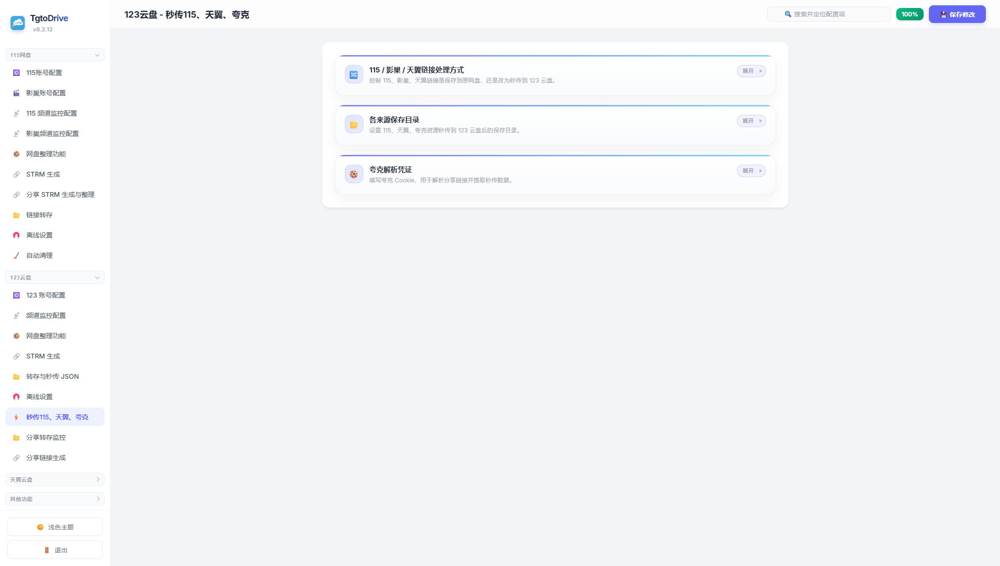

<p align="center">
  
</p>

<h1 align="center">🎬 TgtoDrive (TTD)</h1>

<p align="center">
  <strong>网盘资源自动化管理助手</strong>
</p>

<p align="center">
  <a href="https://hub.docker.com/r/walkingd/tgto123">
    
  </a>
  <a href="https://hub.docker.com/r/walkingd/tgto123">
    
  </a>
  
  
</p>

<p align="center">
  中文 | <a href="README_EN.md">English</a>
</p>

<p align="center">
  <strong><span style="font-size: 1.15em;">Telegram 交流群：<a href="https://t.me/TgtoDriveChat">https://t.me/TgtoDriveChat</a></span></strong>
</p>

<p align="center">
  <strong>一条龙网盘媒体自动化平台：从找资源、自动转存、智能整理、挂载 STRM、到 Emby 302 直链播放，全流程打通；重点强化 115 / 123 云盘整理、115 / 123 STRM 全量与增量生成、以及 Emby 反向代理 302 播放能力。</strong>
</p>

<p align="center">
  <strong>本软件完全免费，后续也不会收费，如果这个项目对你有帮助，请点击右上角 ⭐ Star 支持一下！</strong>
</p>

---

## ✨ 核心定位：找资源 → 转存 → 整理 → 挂 STRM → Emby 播放

你可以把它理解成一个“网盘媒体库自动化流水线”：

1. **找资源**：通过 Telegram 频道监控、榜单订阅、关键词白名单、Pansou、Nullbr、影巢等入口发现资源。
2. **转存资源**：自动把 123 / 115 / 天翼 / 夸克 / 影巢 / 分享链接资源转存到目标网盘目录。
3. **智能整理**：对 115 与 123 网盘里的影视资源自动识别、分类、重命名、洗版。
4. **挂载 STRM**：对 115 与 123 目录生成 STRM，并支持全量扫描、整理后增量同步、元数据下载与失效清理。
5. **Emby 播放**：通过 Emby 反向代理劫持播放请求改写为 302 网盘直链，实现更轻的播放链路。

本文档面向 Docker 镜像使用者，重点介绍功能、部署方式和 Web 配置流程。

## 界面预览

| Emby 看板 | Emby 反代 |
| --- | --- |
|  |  |

| 115 网盘整理 | 123 网盘整理 |
| --- | --- |
|  |  |

| 监控历史 | 整理历史 |
| --- | --- |
|  |  |

| 全局设置 | 实用工具 |
| --- | --- |
|  |  |

## 🚀 重点功能总览

### 1. 📦 115 / 123 网盘整理功能是核心主线能力

项目当前最值得强调的能力，不是“单点转存”，而是 **115 与 123 的影视库自动整理**：

* **TMDB 自动识别刮削**：根据文件名自动匹配影视元数据，减少手工整理成本。
* **主分类自动归档**：电影 / 剧集 / 动漫 / 纪录片 / 综艺自动归类。
* **地区二级归类**：支持把五大类继续按国产 / 欧美 / 日韩 / 其他二次分流。
* **命名标准化**：支持统一重命名规则，提升后续 Emby / Jellyfin / Plex 识别成功率。
* **洗版覆盖策略**：可按剧集“杜比优先”或“非杜比优先”，“大文件优先”或“小文件优先”自动洗版，减少重复资源。
* **115 / 123 双平台覆盖**：不是只有 123，也不是只有 115，而是两套整理链路都已打通。

一句话总结：**把“转存来的资源”自动变成“像样的影视库”。**

### 2. 🎞️ 115 / 123 STRM 全量 + 增量生成能力

项目第二条主线能力，是 **115 / 123 双平台 STRM 输出能力**：

* **123 STRM 全量生成**：按目录扫描批量生成 `.strm`，STRM 采用 fileid 类型，疾速请求直链。
* **115 STRM 全量生成**：与 123 同样支持整库扫描输出，STRM 采用 pickcode 类型，疾速请求直链。
* **整理后自动增量同步**：整理完成后，只对本轮实际变化目录做增量 STRM 更新。
* **元数据增量下载**：字幕、封面、NFO、音频等元数据可一起同步到 STRM 目录。
* **失效 STRM / 空目录清理**：自动维护 STRM 目录整洁度。
* **目录级去重与脏标记重试**：同目录不会重复并发；更新过程中若再次变更会自动重新入队。

也就是说，项目不是“能生成 STRM”这么简单，而是已经形成了：

**整理 → 增量检测 → STRM 更新 → 元数据同步 → 清理失效项** 的闭环。


### 3. 🎬 Emby 反向代理 + 302 直链播放

项目第三条主线能力，是 **Emby 反向代理直链播放**：

* 在 Web 管理页内置 **Emby 反代** 配置页，支持多实例卡片式管理。
* 自动劫持 Emby 的播放请求。
* 把播放请求改写为网盘真实播放地址。
* 结合 STRM 疾速请求直链，返回 **302 跳转直链**，而不是继续让本地服务做重流量代理。
* 失败时会做严格回退与剔除失效播放源，避免播放器乱选错误地址。

这个能力真正解决的是：

**资源明明在网盘里，但 Emby 客户端如何尽量轻量、尽量稳定地直接播放。**

### 4. 🤖 找资源与自动转存能力

为了把上面的“整理 + STRM + Emby”链路喂满，项目还提供了一整套前置资源入口：

* **Telegram 频道监控**：支持 123 / 115 / 天翼 / 影巢频道自动监听与转存。
* **榜单订阅**：支持豆瓣榜单、猫眼榜单自动参与转存判断。
* **关键词白名单 / 黑名单 / 二次分类规则**：对转存触发条件进行精细控制。
* **123 分享链接增量监控**：自动转存新增文件。
* **影巢 / HDHive 深度集成**：支持影巢频道、影巢链接转存与积分阈值控制。
* **万能转发**：对私有频道消息也能通过用户侧复制转发方式触发处理。

### 5. ⚡ 搜索、秒传、离线，补足整条资源链路

为了把“找资源 → 转存入库”做完整，项目还补齐了很多高频工具：

* **多源搜索**：
  * `/share 关键词`：搜索 123 网盘并生成分享链接
  * `/pansou 关键词`：搜索 Pansou 聚合资源
  * `/hdhive 关键词`：搜索影巢资源
* **跨盘秒传**：115 → 123、天翼 → 123、夸克 → 123 等。
* **本地文件秒传**：支持 PT 本地文件扫描后尝试秒传至 123 / 115。
* **多协议离线下载**：Magnet / ed2k / Torrent 自动提交到 123 或 115。
* **短视频下载**：Bilibili / 抖音视频下载。

### 6. 🧰 管理与运维能力

除了资源主链路，本项目也提供了完整的运维辅助能力：

* **全局设置页面**：统一管理代理、全局 TMDB Key、频道监控轮询节奏。
* **关键词白名单可视化配置**：通过卡片式 UI 管理 TMDB 搜索规则、自定义正则和最终表达式预览。
* **Web SSH 终端**：在浏览器里直接连接远程机器。
* **Emby 海报缺失自动检测与刷新**。
* **日志中心 / 监控历史 / 整理历史**。
* **企业微信通知、资源社区发帖、服务器联通性检测**。

### 7. 🧩 Web 配置页面覆盖范围

除了上面的主链路，Web 管理台还提供完整的账号、监控、转存、清理与工具配置：

| 分组 | 页面 |
| --- | --- |
| 系统工具 | Emby 看板、Emby 反代、全局设置、日志中心、监控历史、整理历史、实用工具 |
| 115 网盘 | 115 账号配置、影巢账号配置、115 频道监控、影巢频道监控、网盘整理、STRM、分享 STRM、链接转存、离线设置、自动清理 |
| 123 云盘 | 123 账号配置、频道监控、网盘整理、STRM、转存与秒传 JSON、离线设置、跨盘秒传、分享转存监控、分享链接生成 |
| 天翼云盘 | 天翼账号配置、频道监控、链接转存、自动清理 |
| 其他功能 | SSH 终端、万能转发与 TG API、Pansou、微信通知、资源社区、本地文件秒传、海报刷新、服务器连通性检测、视频下载 |

## 快速部署

### 1. 准备环境

- Docker 20.10+。
- Docker Compose 2.x。
- 一台可长期运行的 NAS / Linux 服务器。
- 如果需要 Telegram 相关功能，请确保容器可以访问 Telegram API。

### 2. 创建部署目录

```bash
mkdir -p tgtodrive
cd tgtodrive
mkdir -p db downloads strm
```

### 3. 编写 `docker-compose.yml`

NAS / Linux 环境推荐使用 `host` 网络模式，便于 Web 管理端、Emby 反代端口和 STRM 播放地址保持一致。

```yaml
services:
  tgtodrive:
    image: walkingd/tgto123:latest
    container_name: TgtoDrive
    network_mode: host
    restart: always
    environment:
      TZ: Asia/Shanghai
      ENV_WEB_PASSPORT: admin
      ENV_WEB_PASSWORD: change_this_password
    volumes:
      # 持久化配置、数据库、日志、任务记录
      - ./db:/app/db

      # STRM 输出目录。左侧替换为你的媒体库目录，右侧固定为 /app/strm
      - ./strm:/app/strm

      # 视频下载输出目录，可按需删除
      - ./downloads:/app/downloads

      # 本地文件秒传扫描目录，可按需删除
      # - /your/nas/transfer:/app/upload
```

如无法使用 `host` 网络模式，可按实际环境映射 Web 管理端口：

```yaml
ports:
  - "12366:12366"
```

### 4. 启动

```bash
docker compose pull
docker compose up -d
```

访问 Web 管理台：

```text
http://你的服务器IP:12366
```

首次登录使用 `docker-compose.yml` 中配置的 `ENV_WEB_PASSPORT` 和 `ENV_WEB_PASSWORD`。

## Web 初始化建议

首次进入 Web 管理台后，建议按下面顺序配置：

1. 打开「全局设置」，配置代理、TMDB Key、Telegram 主机器人。
2. 打开「115 账号配置」「123 账号配置」「天翼账号配置」，补齐要使用的网盘账号。
3. 打开频道监控页面，配置频道 ID、保存目录、关键词和黑名单。
4. 打开「网盘整理功能」，配置扫描目录、归档目录、命名规则和洗版策略。
5. 打开「STRM 生成」，配置 STRM 来源目录和播放基础地址。
6. 打开「Emby 反代」，配置 Emby URL、API Key 与监听端口。
7. 保存配置后等待服务重启，再查看「日志中心」「监控历史」「整理历史」确认运行状态。

## 常用命令

查看运行状态：

```bash
docker compose ps
```

查看日志：

```bash
docker compose logs -f
```

更新镜像：

```bash
docker compose pull
docker compose up -d
```

停止服务：

```bash
docker compose down
```

备份时建议至少保留：

- `db/`：配置、历史、日志、任务状态。
- `strm/`：生成的 STRM 媒体库。

## 功能截图说明

### 系统工具

#### Emby 看板

用于集中查看 Emby 相关运行状态、媒体库信息和反代播放链路概况，方便快速判断媒体服务是否正常。


#### Emby 反代

用于配置 Emby 反向代理实例，管理 Emby 地址、API Key、监听端口和 302 直链播放相关参数。


#### 全局设置

用于统一配置代理、Telegram 主机器人、TMDB Key、频道监控轮询节奏等全局参数。


#### 日志中心

用于查看服务运行日志、任务执行记录和异常信息，是排查转存、整理、STRM、反代问题的主要入口。


#### 监控历史

用于查看频道监控命中的资源、转存状态、消息来源和处理结果，方便回溯自动监控是否按预期运行。


#### 整理历史

用于查看网盘整理任务的识别、归类、重命名、洗版和移动记录，方便确认资源是否整理到正确目录。


#### 实用工具

用于手动执行常用辅助操作和维护任务，适合在排查问题或临时处理资源时使用。


### 115 网盘

#### 115 账号配置

用于配置 115 网盘账号、Cookie、扫码登录和账号状态检测，是 115 转存、整理、STRM 和直链能力的基础。


#### 影巢账号配置

用于配置影巢账号相关信息，供影巢资源搜索、频道监控、链接转存和积分阈值控制等功能使用。


#### 115 频道监控配置

用于配置 115 资源频道监听规则，包括频道 ID、保存目录、关键词白名单、黑名单和分类规则。


#### 影巢频道监控配置

用于配置影巢频道资源的监控与转存规则，支持按关键词、目标目录和触发条件自动处理资源。


#### 网盘整理功能

用于扫描 115 网盘影视目录，自动识别 TMDB 信息，完成分类、重命名、归档和洗版。


#### STRM 生成

用于为 115 网盘目录生成 STRM 文件，并支持全量扫描、增量更新、元数据同步和失效项清理。


#### 分享 STRM 生成与整理

用于处理 115 分享资源的 STRM 生成与整理，把分享链接中的资源接入本地媒体库播放链路。


#### 链接转存

用于手动或自动处理 115 分享链接，将资源保存到指定网盘目录，并结合规则进入后续整理流程。


#### 离线设置

用于配置 115 离线下载相关参数，支持 magnet、ed2k、torrent 等任务提交后的保存与处理。


#### 自动清理

用于配置 115 网盘自动清理策略，按规则清理过期、失效或不再需要的资源与目录。


### 123 云盘

#### 123 账号配置

用于配置 123 云盘账号、Token、目录和状态检测，是 123 转存、秒传、整理和 STRM 的基础配置页。


#### 频道监控配置

用于配置 123 资源频道监控规则，把 Telegram 频道中的资源自动转存到 123 云盘指定目录。


#### 网盘整理功能

用于扫描 123 云盘影视资源，按 TMDB 识别结果自动完成分类、重命名、归档和洗版。


#### STRM 生成

用于为 123 云盘目录生成 STRM 文件，适合把 123 云盘资源接入 Emby、Jellyfin、Plex 等媒体库。


#### 转存与秒传 JSON

用于配置 123 云盘分享链接转存和秒传 JSON 导入能力，适合批量导入已有资源清单。


#### 离线设置

用于配置 123 云盘离线下载任务，支持把 magnet、ed2k、torrent 等链接提交到云盘侧处理。


#### 秒传 115、天翼、夸克

用于配置跨盘秒传能力，把 115、天翼、夸克等来源资源尝试秒传或导入到 123 云盘。



#### 分享转存监控

用于监控 123 分享链接的新增文件，并按规则自动转存到目标目录，适合追更合集类资源。


#### 分享链接生成

用于生成 123 云盘资源分享链接，配合搜索、转发和资源发布流程使用。


### 天翼云盘与其他集成

#### 天翼账号配置

用于配置天翼云盘账号和登录信息，作为天翼资源转存、监控和自动清理的基础。


#### 天翼频道监控配置

用于配置天翼资源频道监听规则，将频道中的天翼分享资源自动转存到指定目录。


#### 天翼链接转存

用于处理天翼云盘分享链接，把链接资源转存到账号内指定位置。


#### 天翼自动清理

用于配置天翼云盘清理规则，自动移除符合条件的过期资源或临时文件。


#### SSH 终端

用于在 Web 页面中连接远程服务器，便于直接查看部署环境、容器状态和相关目录文件。


#### 万能转发与 TG API 配置

用于配置 Telegram API 和万能转发能力，让私有频道、受限频道或用户侧转发消息也能进入自动处理流程。


#### Pansou 聚合搜索配置

用于配置 Pansou 聚合搜索入口，支持通过关键词搜索多来源网盘资源。


#### 微信通知配置

用于配置企业微信通知，把转存、整理、异常、任务完成等消息推送到微信侧。


#### 资源社区配置

用于配置资源社区发布能力，把整理好的资源信息按规则发布到指定社区或频道。


#### 本地文件秒传配置

用于扫描本地 PT 或下载目录，尝试把本地文件秒传到 123 / 115 等网盘，减少重复上传流量。


#### Emby 缺失海报检测与刷新

用于检测 Emby 媒体库中缺失海报的条目，并触发刷新，提升媒体库封面展示完整度。


#### 服务器连通性检测

用于检测服务器到 Telegram、网盘、TMDB、Emby 等关键服务的网络连通性，方便定位网络或代理问题。


#### 视频下载功能

用于配置和执行视频下载任务，支持把下载内容保存到容器映射目录，便于后续整理或入库。


## FAQ

### 为什么某些功能无法使用？

大部分功能依赖 Web 管理台中的账号、目录、代理、Bot、TMDB Key 等配置。请先确认对应页面已保存配置，并在「日志中心」查看运行状态。

### 频道监控没有反应怎么办？

优先检查 Telegram 网络连通性、频道 ID、关键词规则、黑名单规则、保存目录和轮询间隔。私有频道或受限频道可考虑使用万能转发。

### STRM 可以生成但 Emby 无法播放怎么办？

确认 STRM 播放基础地址能被 Emby 服务器访问；确认 115 / 123 账号仍有效；确认 Emby 反代实例已运行；确认播放器访问的端口没有被防火墙阻断。

### 115 Cookie 失效怎么办？

进入「115 账号配置」重新填写 Cookie，或使用页面中的扫码登录能力重新获取。

### 整理目录应该如何配置？

源目录和目标目录不要相同，目标目录也不要放在源目录内部，否则可能造成重复扫描或循环整理。Web 页面会对这类高风险配置给出提示。

## 免责声明

- TgtoDrive 仅用于个人网盘文件管理、自动整理和媒体库维护。
- 请确保你拥有对应账号、资源和媒体内容的合法使用权。
- 请遵守所在地区法律法规、网盘服务条款和第三方服务规则。
- 使用过程中产生的账号、数据、网络和版权风险由使用者自行承担。

---

<p align="center">
  <strong>如果 TgtoDrive 对你有帮助，欢迎加入交流群反馈使用体验。</strong>
</p>
