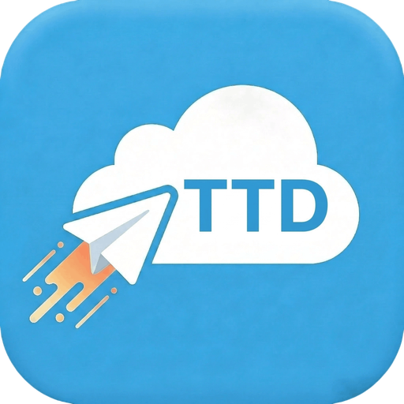
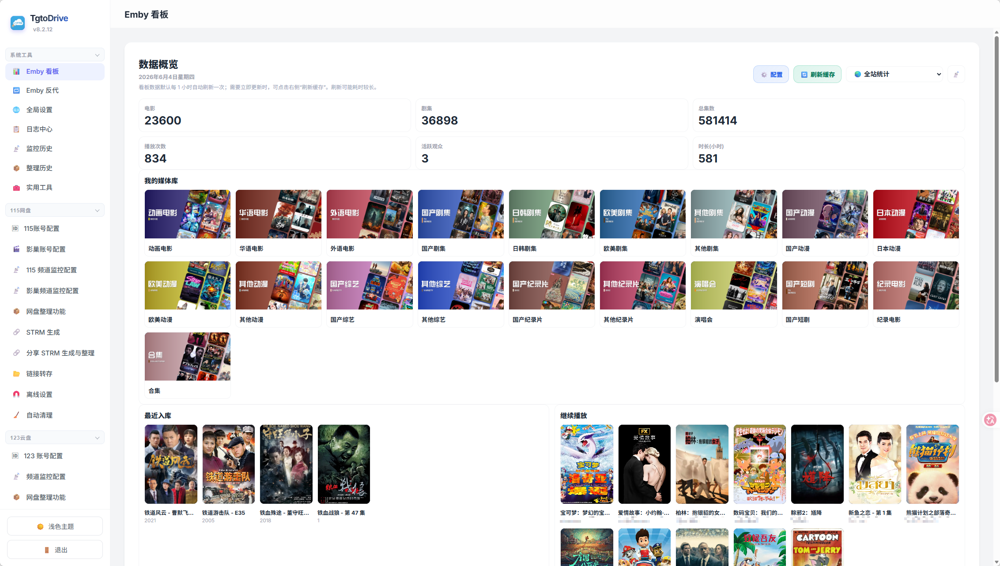
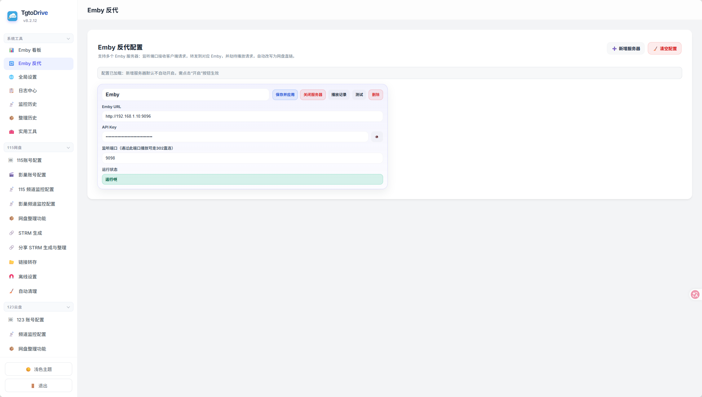
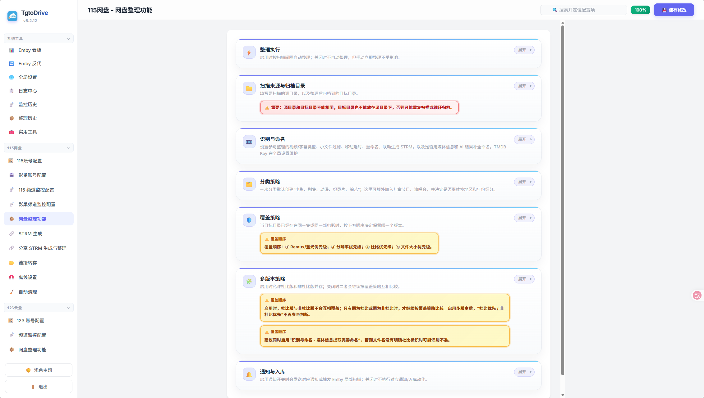
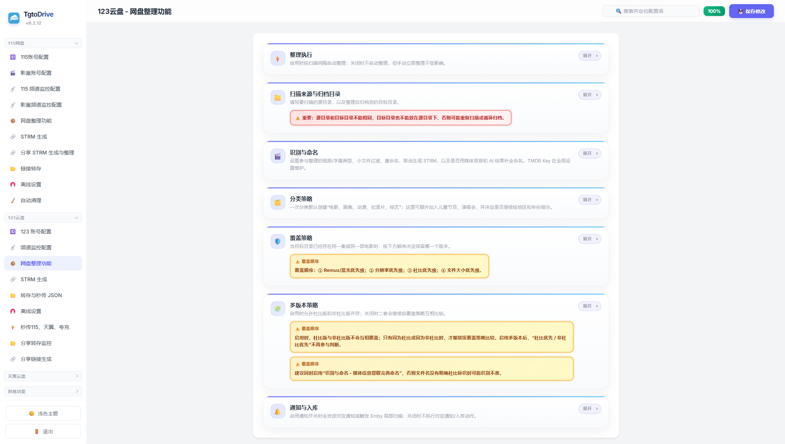
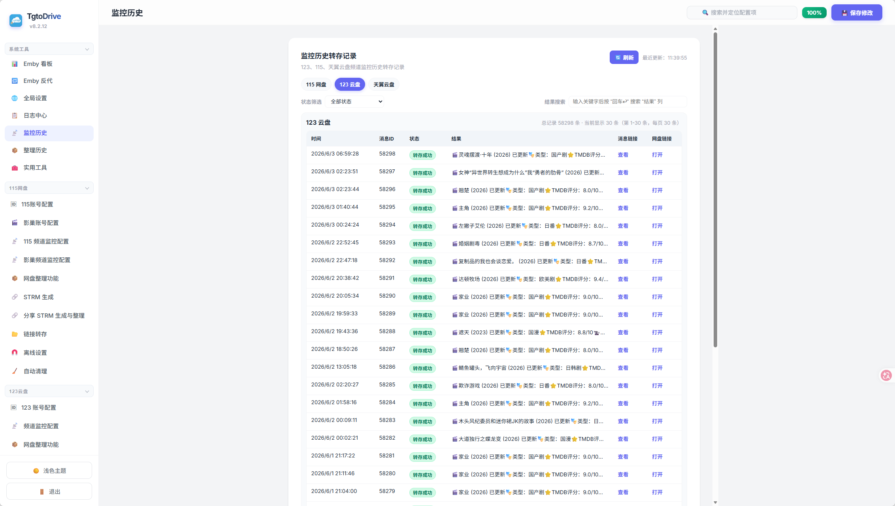
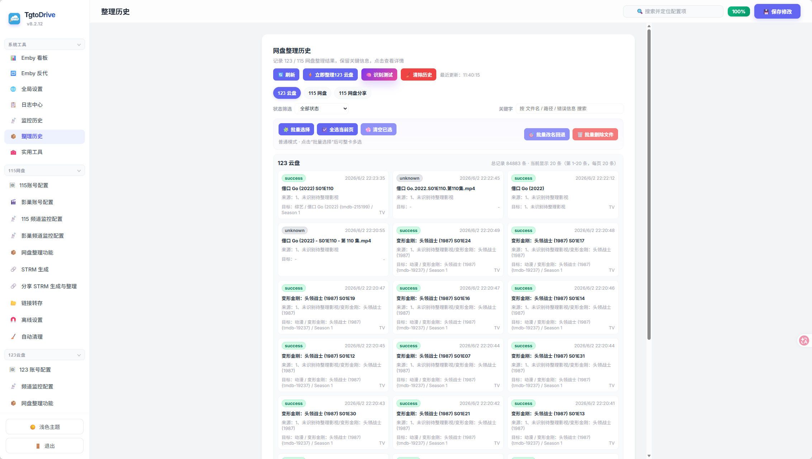
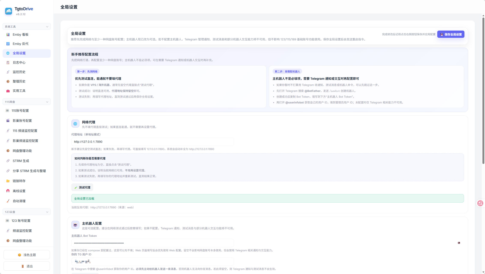
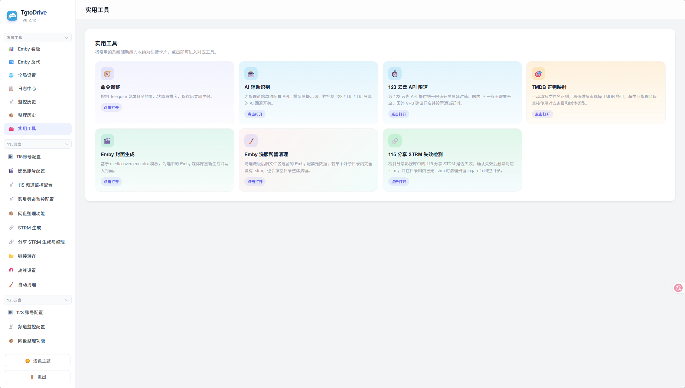
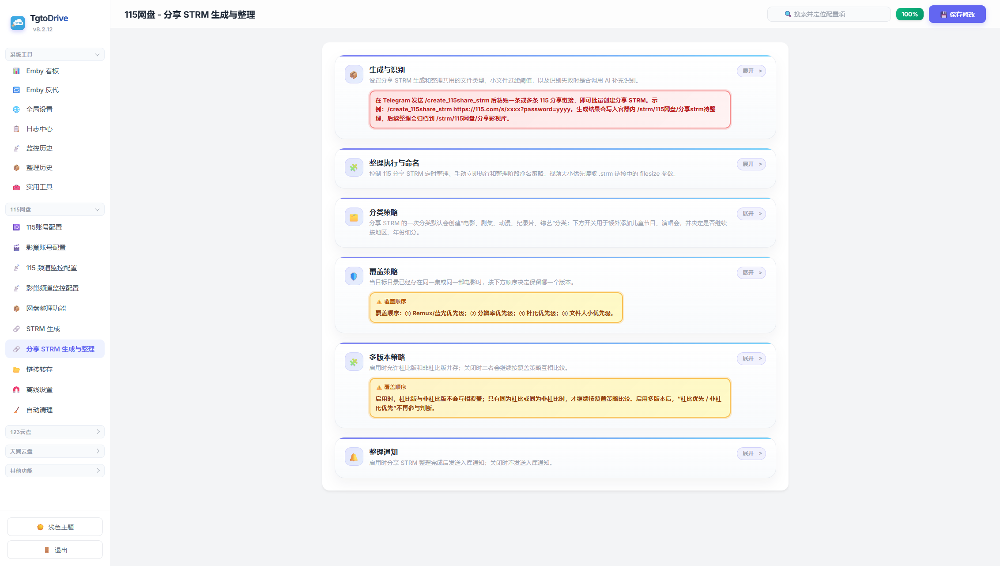

<p align="center">
  
</p>

<h1 align="center">TgtoDrive</h1>

<p align="center">
  <strong>A Dockerized automation platform for cloud-drive media libraries</strong>
</p>

<p align="center">
  <a href="https://hub.docker.com/r/walkingd/tgto123">
    
  </a>
  <a href="https://hub.docker.com/r/walkingd/tgto123">
    
  </a>
  
  
</p>

<p align="center">
  <a href="README.md">中文</a> | English | Telegram Community: <a href="https://t.me/TgtoDriveChat">https://t.me/TgtoDriveChat</a>
</p>

---

## Overview

TgtoDrive is a Web-console-first automation platform for NAS and home-server media workflows. It connects resource discovery, Telegram monitoring, cloud-drive transfer, media organization, STRM generation, Emby dashboards, and Emby 302 direct-link playback into one continuous workflow.

Typical flow:

```text
Discovery / channel monitoring
        -> Transfer to 123 / 115 / Tianyi and other cloud drives
        -> TMDB / AI-assisted media organization
        -> Generate 115 / 123 STRM libraries
        -> Emby dashboard and 302 direct-link playback
```

This README is written for Docker image users and focuses on features, deployment, and Web configuration.

## Screenshots

| Emby Dashboard | Emby Reverse Proxy |
| --- | --- |
|  |  |

| 115 Organizer | 123 Organizer |
| --- | --- |
|  |  |

| Transfer History | Organize History |
| --- | --- |
|  |  |

| Global Settings | Toolbox |
| --- | --- |
|  |  |

## Key Features

### Cloud-drive accounts and resource entry points

| Feature | Description |
| --- | --- |
| 123 Cloud Drive | Account setup, channel monitoring, share transfer, JSON fast import, offline tasks, STRM generation |
| 115 Cloud Drive | Cookie / QR login, channel monitoring, organization, STRM, shared STRM, link transfer, offline tasks, cleanup |
| Tianyi Cloud Drive | Account setup, channel monitoring, link transfer, cleanup |
| HDHive | OAuth authorization, check-in, channel monitoring, transfer workflow, Tianyi-link handling |
| Telegram | Channel monitoring, keyword rules, universal forwarding, scheduled sending, bot notifications |
| Search integrations | Pansou, Nullbr, HDHive and more resource entry points |

### Transfer and monitoring

- Monitor Telegram channels for 123, 115, Tianyi and HDHive resources.
- Use Douban / Maoyan ranking lists and keyword allowlists to trigger transfers.
- Configure blocklists, second-level routing, channel IDs and target folders.
- Monitor 123 share links for incremental updates.
- Manage transfer history, logs and organization history from the Web console.

### Media library organization

TgtoDrive can turn transferred files into a cleaner media library for Emby, Jellyfin or Plex.

| Capability | Description |
| --- | --- |
| Recognition | Match media items with filenames, TMDB, media info and AI assistance |
| Classification | Movies, TV shows, anime, documentaries and variety shows |
| Region grouping | Mainland China, western, Japanese / Korean and other regions |
| Year grouping | Optional year-based subfolders |
| Naming normalization | Standardize movie, season, episode and subtitle naming |
| Upgrade rules | Prefer Remux / Blu-ray, resolution, Dolby and file-size policies |
| Multi-version strategy | Keep Dolby and non-Dolby versions when needed |
| STRM sync | Refresh STRM output after organization changes |

### STRM generation and maintenance

| Capability | Description |
| --- | --- |
| 123 STRM | Generate STRM files from 123 cloud-drive folders |
| 115 STRM | Generate STRM files from 115 cloud-drive folders |
| Shared STRM | Generate and organize STRM files from shared 115 resources |
| Metadata sync | Sync subtitles, posters, NFO files and related assets |
| Invalid cleanup | Remove invalid STRM files and empty directories |
| Deep delete | Trigger cloud-drive cleanup after media deletion in Emby |



### Emby integration

| Feature | Description |
| --- | --- |
| Emby Dashboard | Library statistics, latest media, continue watching and activity views |
| Emby Reverse Proxy | Manage multiple Emby reverse-proxy instances |
| 302 Direct Link Playback | Rewrite playback requests to cloud-drive direct links |
| Playback Records | Inspect reverse-proxy playback records |
| Poster Refresh | Detect and refresh missing Emby posters |
| Metadata Cleanup | Utility workflow for Emby metadata cleanup |

### Operations and utilities

- Global proxy, TMDB key and Telegram main-bot settings.
- Web SSH terminal.
- Pansou aggregation search configuration.
- WeCom notification settings.
- Server connectivity checks.
- Local-file fast import to 123 / 115.
- Bilibili / Douyin video download.
- Community posting settings.
- 123 cloud-drive API rate-limit toolbox.

## Quick Start

### 1. Requirements

- Docker 20.10+.
- Docker Compose 2.x.
- A NAS or Linux server that can run continuously.
- Telegram API connectivity if you need Telegram-related workflows.

### 2. Create a deployment folder

```bash
mkdir -p tgtodrive
cd tgtodrive
mkdir -p db downloads strm
```

### 3. Create `docker-compose.yml`

For NAS / Linux deployments, `host` networking is recommended so the Web console, Emby reverse-proxy ports and STRM playback base URLs remain straightforward.

```yaml
services:
  tgtodrive:
    image: walkingd/tgto123:latest
    container_name: TgtoDrive
    network_mode: host
    restart: always
    environment:
      TZ: Asia/Shanghai
      ENV_WEB_PASSPORT: admin
      ENV_WEB_PASSWORD: change_this_password
    volumes:
      # Persistent configuration, database, logs and task records
      - ./db:/app/db

      # STRM output folder. Replace the left side with your media-library path.
      - ./strm:/app/strm

      # Optional video download folder
      - ./downloads:/app/downloads

      # Optional local-file fast-import scan folder
      # - /your/nas/transfer:/app/upload
```

If `host` networking is not available, map the Web-console port manually:

```yaml
ports:
  - "12366:12366"
```

### 4. Start

```bash
docker compose pull
docker compose up -d
```

Open the Web console:

```text
http://YOUR_SERVER_IP:12366
```

Log in with `ENV_WEB_PASSPORT` and `ENV_WEB_PASSWORD` from your compose file.

## Recommended Web Setup Order

1. Open Global Settings and configure proxy, TMDB key and the Telegram main bot.
2. Configure 115, 123 and Tianyi accounts.
3. Configure channel monitoring: channel IDs, target folders, keywords and blocklists.
4. Configure organizer pages: scan folders, target folders, naming rules and upgrade policies.
5. Configure STRM generation: cloud-drive folders and playback base URL.
6. Configure Emby reverse proxy: Emby URL, API key and listen port.
7. Save settings, wait for the service to restart, then inspect Logs, Transfer History and Organize History.

## Common Commands

Check status:

```bash
docker compose ps
```

Follow logs:

```bash
docker compose logs -f
```

Update:

```bash
docker compose pull
docker compose up -d
```

Stop:

```bash
docker compose down
```

Recommended backup items:

- `db/`: configuration, history, logs and task state.
- `strm/`: generated STRM media library.

## Screenshot Index

### System Tools

- [Emby Dashboard](picture/Emby看板.png)
- [Emby Reverse Proxy](picture/Emby反代.png)
- [Global Settings](picture/全局设置.png)
- [Logs](picture/日志中心.png)
- [Transfer History](picture/监控历史.png)
- [Organize History](picture/整理历史.png)
- [Toolbox](picture/实用工具.png)
- [SSH Terminal](picture/SSH终端.png)

### 115 Cloud Drive

- [115 Account](picture/115网盘-115账号配置.png)
- [HDHive Account](picture/115网盘-影巢账号配置.png)
- [115 Channel Monitoring](picture/115网盘-115频道监控配置.png)
- [HDHive Channel Monitoring](picture/115网盘-影巢频道监控配置.png)
- [Organizer](picture/115网盘-网盘整理功能.png)
- [STRM](picture/115网盘-STRM生成.png)
- [Shared STRM](picture/115网盘-分享STRM生成与整理.png)
- [Link Transfer](picture/115网盘-链接转存.png)
- [Offline Settings](picture/115网盘-离线设置.png)
- [Cleanup](picture/115网盘-自动清理.png)

### 123 Cloud Drive

- [123 Account](picture/123云盘-123账号配置.png)
- [Channel Monitoring](picture/123云盘-频道监控配置.png)
- [Organizer](picture/123云盘-网盘整理功能.png)
- [STRM](picture/123云盘-STRM生成.png)
- [Transfer and JSON Fast Import](picture/123云盘-转存与秒传JSON.png)
- [Offline Settings](picture/123云盘-离线设置.png)
- [Fast Import from 115, Tianyi and Quark](picture/123云盘-秒传115、天翼、夸克.png)
- [Share Monitor](picture/123云盘-分享转存监控.png)
- [Share Generation](picture/123云盘-分享链接生成.png)

### Tianyi and Other Integrations

- [Tianyi Account](picture/天翼云盘-天翼账号配置.png)
- [Tianyi Channel Monitoring](picture/天翼云盘-频道监控配置.png)
- [Tianyi Link Transfer](picture/天翼云盘-链接转存.png)
- [Tianyi Cleanup](picture/天翼云盘-自动清理.png)
- [Universal Forwarding and TG API](picture/万能转发与TGAPI配置.png)
- [Pansou Aggregation Search](picture/Pansou聚合搜索配置.png)
- [WeCom Notifications](picture/微信通知配置.png)
- [Community Posting](picture/资源社区配置.png)
- [Local File Fast Import](picture/本地文件秒传配置.png)
- [Emby Missing Poster Refresh](picture/Emby缺失海报检测与刷新.png)
- [Server Connectivity Checks](picture/服务器连通性检测.png)
- [Video Download](picture/视频下载功能.png)

## FAQ

### Why do some features not work?

Most workflows depend on account, folder, proxy, bot and TMDB settings in the Web console. Save the relevant configuration first, then check the Logs page.

### Why is channel monitoring not picking up messages?

Check Telegram connectivity, channel ID, keyword rules, blocklists, target folders and polling interval. For private or restricted channels, universal forwarding may be a better fit.

### STRM files are generated, but Emby cannot play them. What should I check?

Make sure the STRM playback base URL is reachable from the Emby server, the 115 / 123 account is still valid, the Emby reverse-proxy instance is running, and the required ports are not blocked.

### What if the 115 Cookie expires?

Open the 115 account page and update the Cookie, or use the QR-login workflow from the Web console.

### How should organizer folders be configured?

The scan folder and target folder should not be the same. The target folder should not be placed inside the scan folder, otherwise repeated scans or organization loops may happen.

## Disclaimer

- TgtoDrive is intended for personal cloud-drive file management, automated organization and media-library maintenance.
- Make sure you have the legal right to use the relevant accounts, resources and media files.
- Follow your local laws, cloud-drive service terms and third-party service rules.
- Account, data, network and copyright risks are the user's responsibility.
